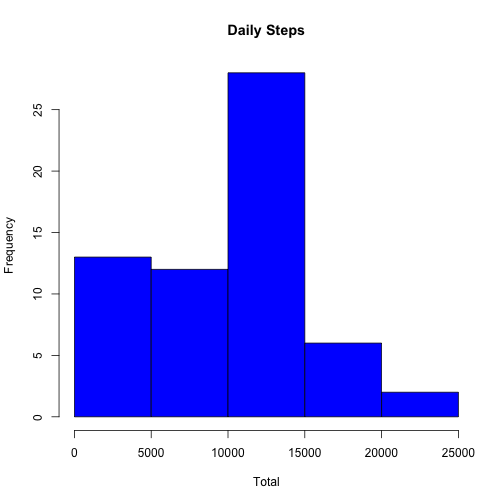
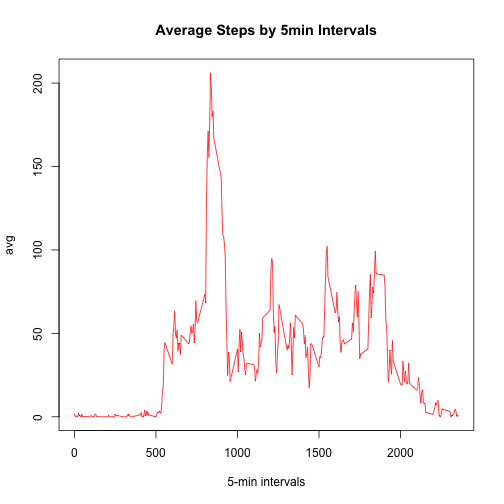
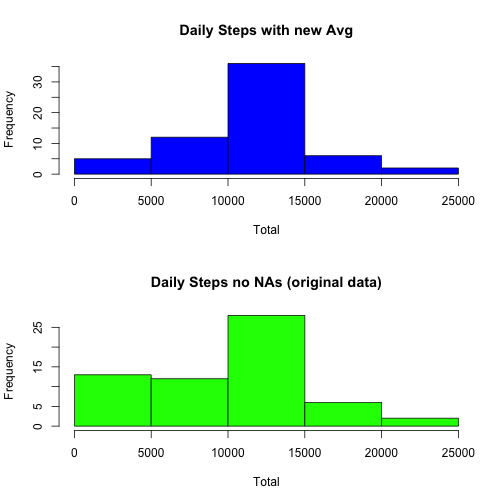
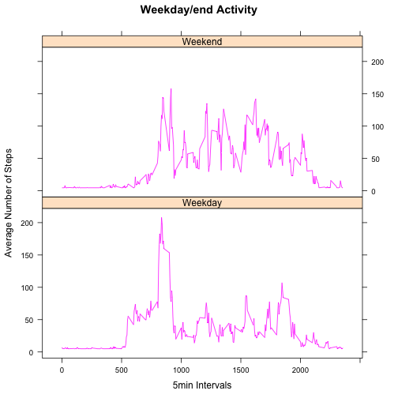

###Introduction
It is now possible to collect a large amount of data about personal movement using activity monitoring devices such as a Fitbit, Nike Fuelband, or Jawbone Up. These type of devices are part of the “quantified self” movement – a group of enthusiasts who take measurements about themselves regularly to improve their health, to find patterns in their behavior, or because they are tech geeks. But these data remain under-utilized both because the raw data are hard to obtain and there is a lack of statistical methods and software for processing and interpreting the data.

This program makes use of data from a personal activity monitoring device. This device collects data at 5 minute intervals through out the day. The data consists of two months of data from an anonymous individual collected during the months of October and November, 2012 and include the number of steps taken in 5 minute intervals each day.

Data used for this report can be retrieved 
[here](https://d396qusza40orc.cloudfront.net/repdata%2Fdata%2Factivity.zip)
after which we load the data and perform our analysis


```r
library(dplyr)
data <- read.csv(file="activity.csv",header=TRUE)
# convert Date column to Date type
data$date <- as.Date(data$date,"%Y-%m-%d")

#convert data frame into data frame table for easier querying
DFT <- tbl_df(data)
```

Data Summary


```r
summary(data)
```

```
##      steps             date               interval     
##  Min.   :  0.00   Min.   :2012-10-01   Min.   :   0.0  
##  1st Qu.:  0.00   1st Qu.:2012-10-16   1st Qu.: 588.8  
##  Median :  0.00   Median :2012-10-31   Median :1177.5  
##  Mean   : 37.38   Mean   :2012-10-31   Mean   :1177.5  
##  3rd Qu.: 12.00   3rd Qu.:2012-11-15   3rd Qu.:1766.2  
##  Max.   :806.00   Max.   :2012-11-30   Max.   :2355.0  
##  NA's   :2304
```


```r
#calculate total steps per day
daily_steps <- summarize(group_by(DFT,date),total_steps=sum(steps,na.rm=TRUE))
```
####What is mean total number of steps taken per day?

1. Total number of steps per day:


 

3. Mean and Median steps per day:

```r
#calculate median and mean of total number of steps per day
median(daily_steps$total_steps)
```

```
## [1] 10395
```

```r
mean(daily_steps$total_steps)
```

```
## [1] 9354.23
```

####What is the average daily activity pattern?


```r
avg_steps <- summarize(group_by(DFT,interval),average_steps=mean(steps,na.rm=TRUE))

plot(avg_steps$interval, avg_steps$average_steps,typ="l",col="red",xlab="5-min intervals",ylab="avg",main="Average Steps by 5min Intervals")
```

 

2. 5-minute interval, on average, with most steps:

```r
subset(avg_steps, average_steps == max(avg_steps$average_steps), select = interval)
```

```
## Source: local data frame [1 x 1]
## 
##   interval
## 1      835
```

####Imputing missing values

1. Total number of NAs in dataset

```r
sum(is.na(DFT))
```

```
## [1] 2304
```


```r
#strategy for replacing NAs in dataset with 0
#create new data to hold updated data
xDFT <- DFT

#get overall mean of steps
# dd <- summarize(group_by(xDFT,date),total_steps=as.integer(mean(steps,na.rm=TRUE)))
smry.mean <- mean(xDFT$steps,na.rm=TRUE)

xDFT[is.na(xDFT)] <- smry.mean
```

4. Total number of steps per day based on complete (new) dataset:


```r
daily_steps2 <- summarize(group_by(xDFT,date),total_steps=sum(steps))

par(mfrow=c(2,1))
hist(daily_steps2$total_steps,col="blue",main="Daily Steps with new Avg",xlab="Total")
hist(daily_steps$total_steps,col="green",main="Daily Steps no NAs (original data)",xlab="Total")
```

 

New means and medians after replacing NAs

```r
median(daily_steps2$total_steps)
```

```
## [1] 10766.19
```

```r
mean(daily_steps2$total_steps)
```

```
## [1] 10766.19
```

####Are there differences in activity patterns between weekdays and weekends?

```r
ddd <- xDFT
ddd <- mutate(ddd, wkflag=ifelse(weekdays(ddd$date) %in% c("Saturday","Sunday"),"Weekend","Weekday"))

ddd$wkflag <- as.factor(ddd$wkflag)

avg_steps2 <- summarize(group_by(ddd,wkflag,interval),average_steps=mean(steps))

library(lattice)
xyplot(avg_steps2$average_steps ~ avg_steps2$interval|avg_steps2$wkflag, layout=c(1,2),
       main="Weekday/end Activity",ylab="Average Number of Steps",xlab="5min Intervals",type="l",col="magenta")
```

 


